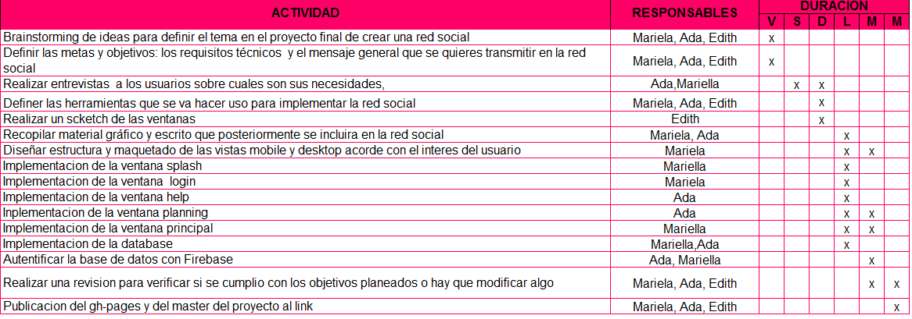
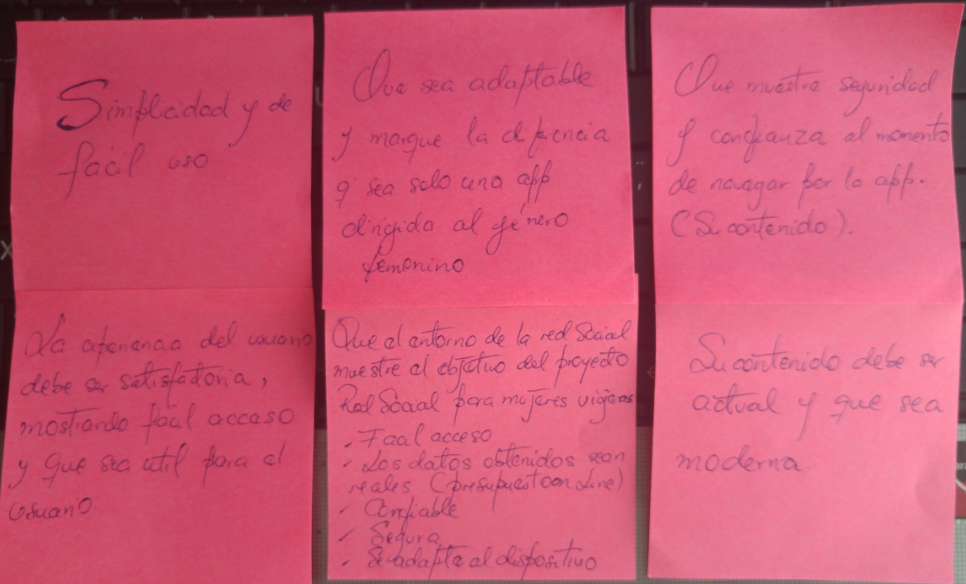
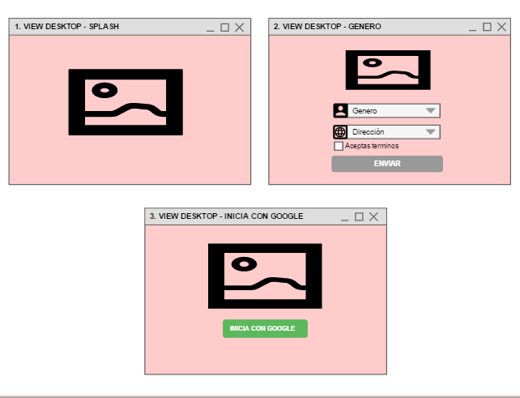
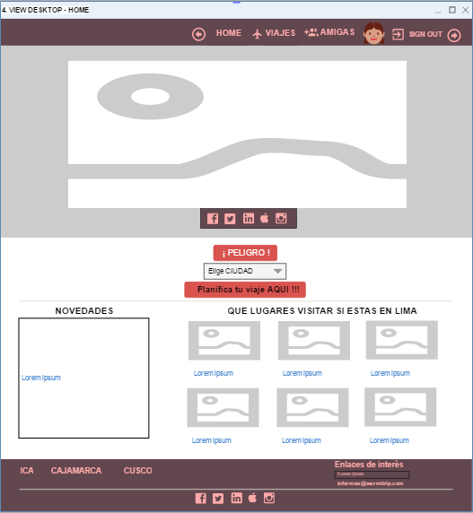
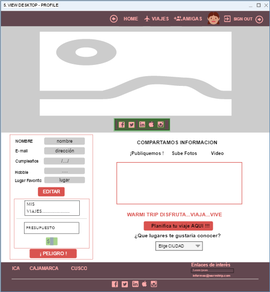
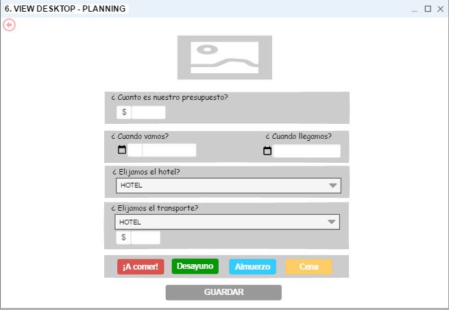
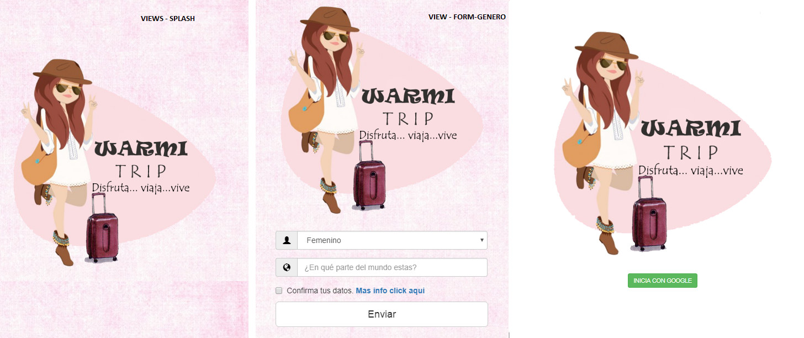
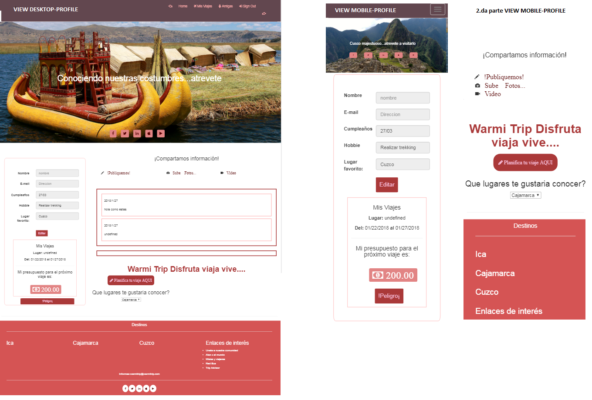
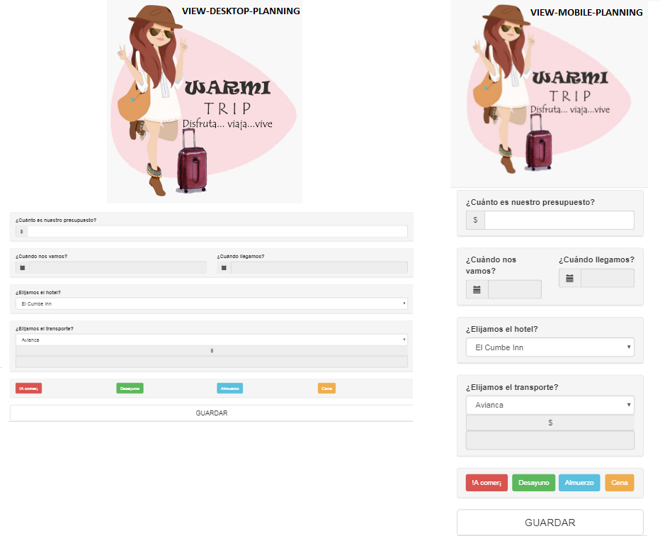

# PROYECTO: Red Social WARMI TRIP
# BAJO EL LEMA: Disfruta…viaja…vive.

 

# NOMBRE DE PARTICIPANTES

*   Ada Tatiana Yahuanca Chupa: UX Designer y Front End.
    -   Como UX Designer fue encargada del research, research cualitativo y cuantitativo asimismo aplicación de métodos como entrevistas y encuestas para dar lugar al procesamiento y análisis de información. Como Front End, implemento la funcionalidad, formulario de login, planificación, profile, modales de información, manejo de base de datos en Firebase y conexión.

*   Mariela Deysi Cerna Peralta: UX Designer y UI.
    -   Como UX Designer fue encargada del research, research cualitativo y cuantitativo asimismo aplicación de métodos como entrevistas y encuestas para dar lugar al procesamiento y análisis de información. Como UI desarrollo de maquetación, sketches, readme y logotipo, apoyo parte de front end, creación de base de datos y formulario genero con validaciones.

### CRONOGRAMA DE ESTUDIOS.
 

    
### RESEARCH: METODOS DE LEVANTAMIENTO DE INFORMACION.
*   Research Cualitativo
      -  Entrevista
         -   Face to face.
         -   Wasap.
         -   Audios.
      -  Feedback

*   Research Cuantitativo
      - Muestra 6 personas.
      -  Presentación de los primeros mockups

### HERRAMIENTAS DE ENTREVISTAS.
*     -  Lápiz y papel.
      -  Celular para audios y  textos.      
    
### USER RESEARCH: NUESTRO CLIENTE NOS INFORMO ALGUNOS PUNTOS BASICO QUE DEBE TENER UNA RED SOCIAL

*   Un newsfeed donde puedes ver las actualizaciones de todos tus contactos.
*   Un lugar donde poder escribir posts.
*   Un lugar para subir fotos.
*   Un espacio en el cual pueda visualizar los últimos sucesos en los que han sido victima las mujeres.
*   Una herramienta que le permita planificar sus viajes en cuanto a presupuesto de hoteles y transporte.

### ¿QUÉ SE REQUIERE?
*   Trabajar en parejas
*   Tener una planificación
*   La definición del diseño
*   Diseño mobile friendly
*   Desplegar el producto en Github gh-pages
*   Opcional, si se desarrolla un login o se desea almacenar la información en una base de datos, usar Firebase.

### PROCESOS DE DISEÑO DE LA EXPERIENCIA

-   Se analiza el tema a fondo, se utiliza la técnica de affinity maps, se realiza coordinaciones con el equipo de trabajo se procede con el research.
 

-   La información obtenida por los usuarios se analiza, procesa y se obtiene la idea central para el desarrollo del producto.
-   La experiencia de usuario es enriquecedora, el siguiente paso es la creación de los primeros sketches, los diseños son básicos hechos a lápiz y papel y son mostrados a los usuarios.
-   Después de recibir el feedback por parte de los usuarios se realiza una segunda entrevista más detallada esto nos sirve para profundizar en el tema, el proceso nos dio como resultado conocer quiénes serían nuestros usuarios, que funcionalidad es la más adecuada y de fácil manejo, la exista  de un medio de alerta, un botón que nos ayude a planificar y un lugar donde solo sea para féminas, son algunos de los requisitos de nuestros cliente potenciales.
-   Con la investigación resuelta y los mockups hechos, se procede al siguiente paso proceso de UI, maquetación y elección de colores de cada una de las vistas desktop Tablet y Mobile.
-   Luego se le adiciona funcionalidad, rapidez y simpleza, que sea entendible al usuario y su experiencia sea enriquecedora.
-   Se realizaron las pruebas de funcionalidad.

### MOCKUPS - PROTOTIPOS

 

 

 

 

### SOSTENIBILIDAD E IDEAS PRINCIPALES.
*   Existe muchas páginas viajeras, blog, agencias de viaje, y demás, pero muy pocas en nuestro país que muestre el interés de segmentar el mercado y que el producto este destinado solo a mujeres, aquí menciono algunas páginas:
-   https://www.ytuqueplanes.com/
-   https://www.milmillasmochileras.com/america
-   https://es-la.facebook.com/misiasperoviajeras/

Todas estas páginas ofrecen las mejores experiencias de usuario, lugares a donde visitar foros, chat, etc; pero lo que no muestran es como sacar un presupuesto, si nos sentimos en peligro o perdidas enviar una alerta a tus amigos para que se pongan en contacto contigo o llamar a las autoridades más cercanas, saber la existencia de una catástrofe o conocer si existe algún lugar inseguro o vulnerable que no puedes visitar por tu seguridad, saber resultados del clima por temporada y ofrecerte el atuendo más adecuado, o simplemente queremos hablar entre nosotras y sentirnos más en confianza y hacer nuestra comunidad viajera, hecha con una sola idea y bajo el lema “Disfruta, viaja y vive”, así es WarmiTrip una aplicación hecha para la mujer moderna.

### HERRAMIENTAS UTILIZADAS PARA EL DESARROLLO DE PRODUCTO.
*   Framework Bootstrap.
*   HTML5.
*   CSS3.
*   Jquery.

## USO DE FIREBASE

*   Es un servicio de Google para desarrollar aplicaciones para web y dispositivos con mayor rapidez con componentes de back-end desde lado del cliente.
*   La funcionalidad para el usuario es simple, solo debe registrarse usando su cuenta de gmail, este proceso tan simple evita que pierdas tiempo registrándote como usuario nuevo. 

### ELEMENTOS, VIEWS y FUNCIONALIDAD.
*   Creación de un logotipo en photoshop.
*   Definición de paleta de colores y diseño de cada una de las views.
*   Se utiliza una nueva herramienta de base de datos online llamado  Firebase (almacena datos en tiempo real), se implementó para el uso del formulario login, firebase tiene la ventaja de conectarse mediante redes sociales o gmail; en nuestro caso se utilizó la conexión vía gmail.
    -   Lista de vistas:
        -   Splash.
        -   Login – Genero.
        -   Ingresa con Gmail. 
        -   Home.
        -   Profile.
        -   Monedero para presupuestar los viajes.
    -   Modales:
        -   Referencias.
        -   Mapas de ubicación.
    -   Funcionalidad:
        -   Registro de usuario.
        -   Planificación de viaje.
        -   Perfil de usuario.
        -   Añade comentarios.
        -   Subir fotos.

## DESCRIPCION DE FUNCIONALIAD DE VIEWS

-   Vista inicial: En esta se presenta el logo en una ventana Splash con una duración de 3 segundos.
-   Vista género: El requisito de la red social es que se logueen solo mujeres, por lo tanto se realiza la validación mediante esta ventana.
-   vista perfil:  
    1. Cuenta con un select para seleccionar el departamento en que estas planificando viajar
    2. Un input  que permite  postear estados, recomendaciones, fotos y videos del lugar en el que están visitando, de esta manera la persona  que pueda ver su publicación de las expectativas que genera el lugar e interesarse por viajar

## VIEWS RED SOCIAL WARMI-TRIP.
 

 

 

 

## PRESENTACIÒN DE LA RED SOCIAL
- Se crea un repositorio, y una rama master para web gh-pages.

